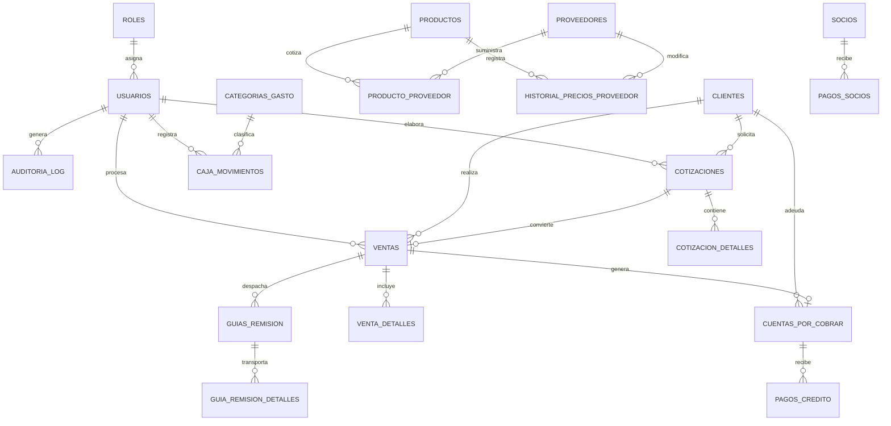

# Modelo de Base de Datos Relacional: INEGO Industrias

## 1. Objetivo del Modelo

El modelo de base de datos relacional diseñado para **INEGO Industrias** responde a los requerimientos operativos de la empresa dedicada a la venta y distribución de artículos de ferretería, equipos y suministros de oficina. 

Este diseño cumple con las siguientes premisas clave:
- **Normalización (3NF)**: Estructura clara, coherente y libre de redundancias innecesarias.
- **Historial de Precios de Proveedores**: Solución a la problemática de cotizaciones recurrentes mediante una tabla de trazabilidad de precios históricos por proveedor sin destruir registros previos.
- **Modelo de Inventario Híbrido**: Soporte para productos de Stock Permanente (cuchillas doble filo, licencias Office) y productos Bajo Pedido (contratos con el gobierno / drop-shipping).
- **Gestión de Crédito B2B**: Control automático de políticas de crédito a **72 días** para clientes institucionales/B2B y cobro al contado para B2C.
- **Trazabilidad Operativa y Auditoría**: Trazabilidad completa en despachos, entregas físicas, guías de remisión, flujo de caja chica y pagos mensuales de socios.

---

## 2. Lista Completa de Tablas

El esquema está compuesto por **17 tablas relacionales**:

1. `roles`
2. `usuarios`
3. `auditoria_log`
4. `categorias_proveedor`
5. `proveedores`
6. `categorias_producto`
7. `productos`
8. `producto_proveedor`
9. `historial_precios_proveedor`
10. `clientes`
11. `impuestos`
12. `cotizaciones`
13. `cotizacion_detalles`
14. `ventas`
15. `venta_detalles`
16. `cuentas_por_cobrar`
17. `pagos_credito`
18. `guias_remision`
19. `guia_remision_detalles`
20. `categorias_gasto`
21. `caja_movimientos`
22. `socios`
23. `pagos_socios`

---

## 3. Propósito de Cada Tabla

| Tabla | Propósito Principal |
| :--- | :--- |
| `roles` | Catálogo de perfiles operativos (`Administrador de Dinero`, `Compras y Mercadería`, `Contabilidad`). |
| `usuarios` | Credenciales de trabajadores con cifrado de clave SHA-256 y estado activo/inactivo. |
| `auditoria_log` | Bitácora automática de auditoría para tareas compartidas (despachos, compras, entregas físicas). |
| `categorias_proveedor` | Clasificación de proveedores (Ferretería, Tecnología, Suministros). |
| `proveedores` | Registro de proveedores etiquetados por ubicación (`Guayaquil 90%`, `Otras Provincias`, `Amazon`, `Tiendamia`). |
| `categorias_producto` | Clasificación de artículos del catálogo comercial. |
| `productos` | Catálogo maestro de productos con indicador de tipo de stock (Permanente vs Bajo Pedido). |
| `producto_proveedor` | Tabla intermedia para la relación N:M entre productos y proveedores con costo cotizado actual. |
| `historial_precios_proveedor` | Registro histórico inmutable de variaciones de costos cotizados por proveedor en el tiempo. |
| `clientes` | Registro de clientes clasificados por tipo (`B2B` con 72 días crédito vs `B2C` al contado). |
| `impuestos` | Almacenamiento configurable de tasas impositivas (`IVA General 15%`, `IVA 0%`). |
| `cotizaciones` | Cabecera de cotizaciones emitidas a clientes con fechas de vencimiento y cálculo de IVA. |
| `cotizacion_detalles` | Líneas de detalle de cotización con producto, proveedor seleccionado, cantidad y subtotal. |
| `ventas` | Cabecera de órdenes de compra/ventas confirmadas sin necesidad de factura electrónica. |
| `venta_detalles` | Líneas de productos incluidos en cada orden de venta. |
| `cuentas_por_cobrar` | Control de saldos pendientes y fechas de vencimiento para ventas a crédito B2B (72 días). |
| `pagos_credito` | Registro de abonos y cancelaciones a las cuentas por cobrar. |
| `guias_remision` | Guías de despacho para transporte físico de mercadería hacia clientes o contratos de gobierno. |
| `guia_remision_detalles` | Detalle de artículos físicos transportados en cada guía de remisión. |
| `categorias_gasto` | Clasificación contable de egresos (Agua/Servicios, Logística, Gestión Operativa, etc.). |
| `caja_movimientos` | Registro de flujo de efectivo de ingresos y gastos de caja chica. |
| `socios` | Registro de los 3 socios de Inego Industrias. |
| `pagos_socios` | Registro mensual de roles de pago a socios ($50 fijo + 5% bono de ventas). |

---

## 4. Claves Principales, Foráneas y Relaciones

- **`roles`**: PK `id`.
- **`usuarios`**: PK `id` | FK `rol_id` ➔ `roles(id)`.
- **`auditoria_log`**: PK `id` | FK `usuario_id` ➔ `usuarios(id)`.
- **`proveedores`**: PK `id` | FK `categoria_id` ➔ `categorias_proveedor(id)`.
- **`productos`**: PK `id` | FK `categoria_id` ➔ `categorias_producto(id)`.
- **`producto_proveedor`**: PK `id` | FK `producto_id` ➔ `productos(id)` | FK `proveedor_id` ➔ `proveedores(id)`.
- **`historial_precios_proveedor`**: PK `id` | FK `producto_id` ➔ `productos(id)` | FK `proveedor_id` ➔ `proveedores(id)`.
- **`cotizaciones`**: PK `id` | FK `cliente_id` ➔ `clientes(id)` | FK `usuario_id` ➔ `usuarios(id)` | FK `impuesto_id` ➔ `impuestos(id)`.
- **`cotizacion_detalles`**: PK `id` | FK `cotizacion_id` ➔ `cotizaciones(id)` | FK `producto_id` ➔ `productos(id)` | FK `proveedor_elegido_id` ➔ `proveedores(id)`.
- **`ventas`**: PK `id` | FK `cotizacion_id` ➔ `cotizaciones(id)` | FK `cliente_id` ➔ `clientes(id)` | FK `usuario_id` ➔ `usuarios(id)`.
- **`venta_detalles`**: PK `id` | FK `venta_id` ➔ `ventas(id)` | FK `producto_id` ➔ `productos(id)`.
- **`cuentas_por_cobrar`**: PK `id` | FK `venta_id` ➔ `ventas(id)` | FK `cliente_id` ➔ `clientes(id)`.
- **`pagos_credito`**: PK `id` | FK `cuenta_por_cobrar_id` ➔ `cuentas_por_cobrar(id)` | FK `usuario_id` ➔ `usuarios(id)`.
- **`guias_remision`**: PK `id` | FK `venta_id` ➔ `ventas(id)` | FK `cliente_id` ➔ `clientes(id)` | FK `usuario_responsable_id` ➔ `usuarios(id)`.
- **`guia_remision_detalles`**: PK `id` | FK `guia_remision_id` ➔ `guias_remision(id)` | FK `producto_id` ➔ `productos(id)`.
- **`caja_movimientos`**: PK `id` | FK `categoria_gasto_id` ➔ `categorias_gasto(id)` | FK `usuario_id` ➔ `usuarios(id)`.
- **`pagos_socios`**: PK `id` | FK `socio_id` ➔ `socios(id)`.

---

## 5. Explicaciones de Casos de Negocio

### 5.1 Relación N:M Producto ↔ Proveedor
Un producto puede ser suministrado por múltiples proveedores (ej. Guayaquil, Quito o EE.UU.), y un proveedor ofrece diversos productos. La tabla `producto_proveedor` resuelve esta relación guardando el `precio_actual`, `tiempo_entrega_dias` y `estado_disponibilidad`.

### 5.2 Historial de Precios de Proveedores
Para evitar volver a cotizar desde cero en cada orden, la tabla `historial_precios_proveedor` almacena un registro inmutable cada vez que cambia el precio cotizado de un proveedor para un producto. Esto permite consultar la evolución de costos a lo largo de los meses.

### 5.3 Modelo de Inventario Híbrido (Stock Permanente vs Bajo Pedido)
- **TIPO A (Stock Permanente)**: Productos de alta rotación (`Cuchillas doble filo`, `Licencias Office`) que mantienen `stock_actual` y `stock_minimo`.
- **TIPO B (Bajo Pedido)**: Artículos para licitaciones o contratos gubernamentales que se compran solo cuando se genera la orden (`stock_actual = 0`).

### 5.4 Políticas de Crédito B2B (72 Días) vs B2C (Contado)
Los clientes `B2B` tienen asignados `dias_credito = 72`. Al generar una venta a crédito, se crea automáticamente un registro en `cuentas_por_cobrar` con fecha de vencimiento a 72 días. Los clientes `B2C` operan estrictamente al contado (`dias_credito = 0`).

### 5.5 Órdenes de Venta y Cotizaciones
El sistema maneja órdenes de compra comerciales sin facturación electrónica (tal como requiere el negocio). La cabecera almacena los totales e impuestos aplicados en ese momento histórico para prevenir distorsiones contables futuras.

### 5.6 Pagos de Socios
Registra mensualmente el pago fijo de $50.00 USD más el cálculo del 5% de comisión sobre las ventas netas del mes, permitiendo ajustes manuales del contador y guardando el histórico formal.

---

## 6. Diagrama Relacional Simplificado en Texto

```
ROLES (1) ───────< (N) USUARIOS (1) ───────< (N) AUDITORIA_LOG
                          │
                          ├─── (1) ───────< (N) COTIZACIONES (1) ───< (N) COTIZACION_DETALLES
                          │                          │
                          │                          └─── (1) ───< (1) VENTAS (1) ───< (N) VENTA_DETALLES
                          │                                               │
                          │                                               ├─── (1) ───< (1) CUENTAS_POR_COBRAR ───< PAGOS_CREDITO
                          │                                               │
                          │                                               └─── (1) ───< (N) GUIAS_REMISION ───< GUIA_DETALLES
                          │
                          └─── (1) ───────< (N) CAJA_MOVIMIENTOS (N) >─── (1) CATEGORIAS_GASTO

PRODUCTOS (1) ───< (N) PRODUCTO_PROVEEDOR (N) >─── (1) PROVEEDORES
    │                                                      │
    └─── (1) ───< (N) HISTORIAL_PRECIOS_PROVEEDOR (N) >────┘

SOCIOS (1) ───────< (N) PAGOS_SOCIOS
```

---

## 7. Diagrama Entidad-Relación (Mermaid ER)



---

## 8. Nota de Validación

> **Estado de Validación**: Validación estática realizada; sintaxis de script `database/schema.sql` revisada minuciosamente. Ejecución contra servidor MySQL pendiente según el entorno.
